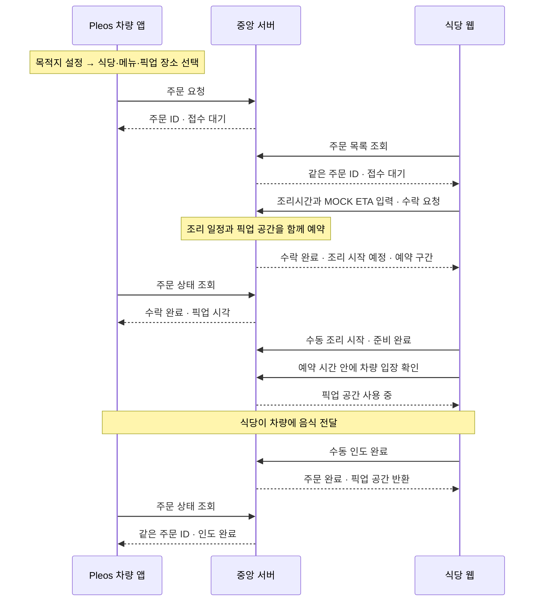

# 밥맞J 차량 픽업 흐름도

```mermaid
sequenceDiagram
    participant Car as Pleos 차량 앱
    participant API as 중앙 서버
    participant Shop as 식당 웹

    Note over Car: 목적지 설정 → 식당·메뉴·픽업 장소 선택
    Car->>API: 주문 요청
    API-->>Car: 주문 ID · 접수 대기
    Shop->>API: 주문 목록 조회
    API-->>Shop: 같은 주문 ID · 접수 대기
    Shop->>API: 조리시간과 MOCK ETA 입력 · 수락 요청
    Note over API: 조리 일정과 픽업 공간을 함께 예약
    API-->>Shop: 수락 완료 · 조리 시작 예정 · 예약 구간
    Car->>API: 주문 상태 조회
    API-->>Car: 수락 완료 · 픽업 시각
    Shop->>API: 수동 조리 시작 · 준비 완료
    Shop->>API: 예약 시간 안에 차량 입장 확인
    API-->>Shop: 픽업 공간 사용 중
    Note over Car,Shop: 식당이 차량에 음식 전달
    Shop->>API: 수동 인도 완료
    API-->>Shop: 주문 완료 · 픽업 공간 반환
    Car->>API: 주문 상태 조회
    API-->>Car: 같은 주문 ID · 인도 완료
```

11월 12일 시연에서 조리 일정은 식당이 입력한 모의 ETA로 계산했습니다. 차량 입장과 인도는 식당 웹에서 수동으로 확인했습니다. [시연 영상](./babmatj-pickup-demo.mp4)
